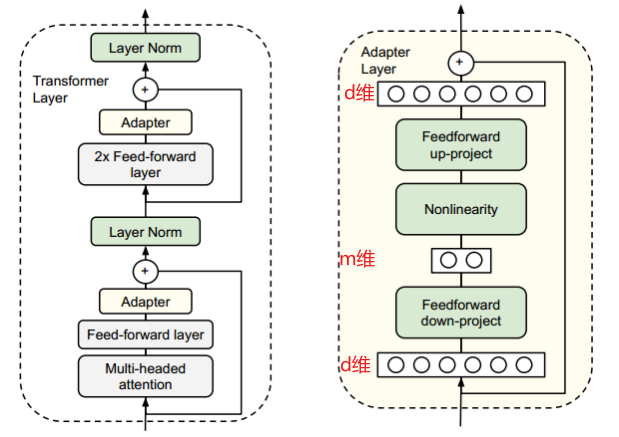
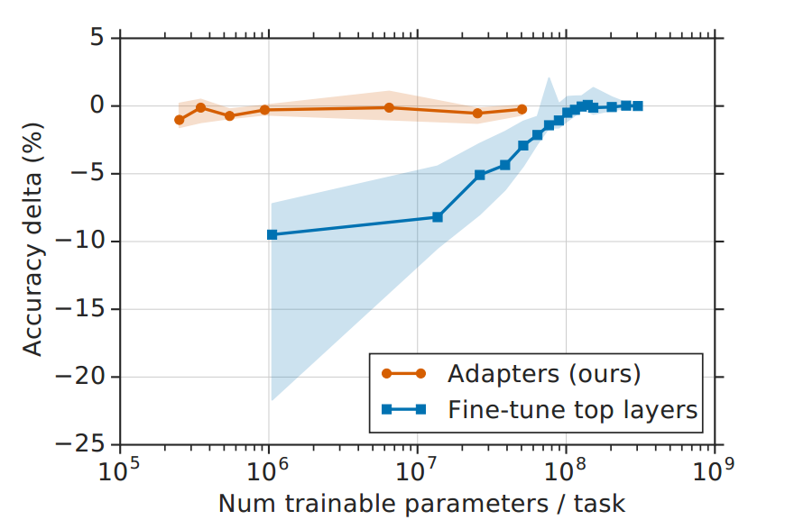
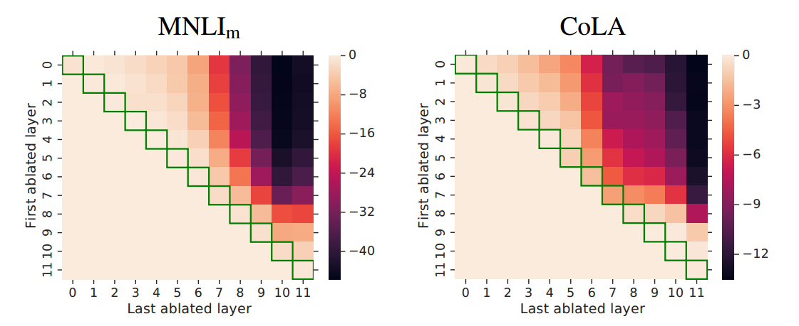

### 1. 前言

fine-tune是一种低效的参数更新方式，对于每一个下游任务，都需要去更新语言模型的全部参数，这需要庞大的训练资源。Adapter会针对每个下游任务在语言模型的每层transformer中新增2个带有少量参数的模块，针对下游任务训练时只更新adapter模块参数，而冻结原有语言模型的参数；Adapter方法不需要微调预训练模型的全部参数，通过引入少量针对特定任务的参数，来存储有关该任务的知识，降低对模型微调的算力要求。

### 2. Adapter模块介绍

- adapter结构：

每一个adapter由两个前馈层，一个非线性函数，和一个残差连接组成。

- adapter两个主要特点：

（1）少量参数

每一个Transformer结构都有两个adapter模块，(如下图左侧结构所示)，在针对不同下游任务进行调整时，只需将原始网络的参数冻结，只针对adapter层添加的少量参数进行训练。

> *adapter引入的模型参数：*

假设adapter的输入特征维度是d，而中间的特征维度是m；

每个adapter模块由两个前馈子层组成，通过一个feedforward down-project层，将原始输入维度d投影到m，

在输出阶段，通过feedforward up-project层，将m维重新投影到d维，作为adapter模块的输出(如上图右侧结构)。

那么新增的模型参数有：

down-project的参数$d*m+m$，up-project的参数$m*d+d$，共$2md+m+d$

*layer norm（层归一化）：*
$$
y=\frac{x-E[x]}{\sqrt{Var[x]+\epsilon}}*\gamma+\beta
$$
针对下游任务训练需要更新的参数，除了adapter引入的模型参数，还有adapter层后的layer norm层参数的更新。每个layer norm层均值和方差需要更新，所以更新的参数为$2d$

因此，**添加一个adapter，需要更新的参数共$2md+3d+m$**

通过控制m的大小来限制adapter模块的参数量，权衡性能与参数效率，通常情况下$m<<d$；adapter的大小控制着参数效率，较小的adapter引入的参数更少，可能会以性能为代价。

（2）a near-identity initialization

残差连接就是把网络的输入和输出相加，即网络的输出为F(x)+x

通过残差连接，保证即便adapter一开始的参数初始化接近0（参数初始化接近0，F(x)结果接近0），adapter可以通过残差连接（+x）的设置而初始化接近于一个恒等映射，从而保证训练的有效性。

### 3. 实验结果

- adapter与fine-tune效果对比

最佳适配器的大小（m的设置大小）因数据集大小而异。{8,64,256}

adapter(8-256)的GLUE平均得分80.0，

完全微调的GLUE平均得分80.4；

adapter(64)的GLUE平均得分79.6。（m总是选择大小为64，平均精度小幅度下降）

可以看出，只训练少量参数的adapter可以达到与完全微调基本相同的效果。

- 模型性能与参数效率

只更新fine-tune top N 层的参数，下图可以看出，当fine-tune训练参数减少时，模型的准确率逐渐下降，而adapter有很好的鲁棒性。

GLUE验证集上的结果，基于适配器的调优在训练参数少两个数量级的情况下获得了与完全微调相似的性能。

- 模型性能与参数效率（MNLIm验证集）

图中，黄线上标注为使用的adapter模块大小（m的取值），蓝线上标注为fine-tune top N层，N的取值。

可以看出，当使用相当数量的特定于任务的参数进行微调时，adapter性能更好。

仅对顶层（N=1）进行微调，产生的可训练参数约9*10^6，验证精度约77.8%

尺寸为64的adapter，产生的可训练参数约2*10^6，精度约为83.7%，

完全微调（N=12）产生的可训练参数约10^8，精度约84.4%

- 执行消融确定每一层adapter有何影响

从连续的层跨度中去掉经过训练的适配器，并在验证集上重新评估模型

（1）热图的对角线显示了从单层中删除adapter的性能，可以看出，删除任何单个层的adapter对性能产生的影响很小；当所有层的adapter都删除时，性能大幅度下降；这表明虽然每个adapter对整体网络的影响很小，但整体效果很大。

（2）较低层上的adapter与较高层的adapter相比，影响较小；从MINI上的0-4层移除adapter几乎不会影响性能，这表明adapter表现良好，因为它们会自动优先考虑更高层。

事实上，关注上层是一种流行的微调策略。一种直觉是，较低的层提取任务之间共享的较低级别特征，而较高的层构建不同任务独有的特征。

### 扩展

> Parameter-Efficient Transfer Learning for NLP 
>
> 该文章中提到：

对adapter的扩展：

（i）向adapter添加纵向/横向规范化

（ii）增加每个adapter的层数

（iii）不同的激活函数，如tanh

（iv）只在注意力层插入adapter

（v）向主要层并行添加adapter，并可能使用乘法交互

这些情况下，最终的性能都与原结构相似。

