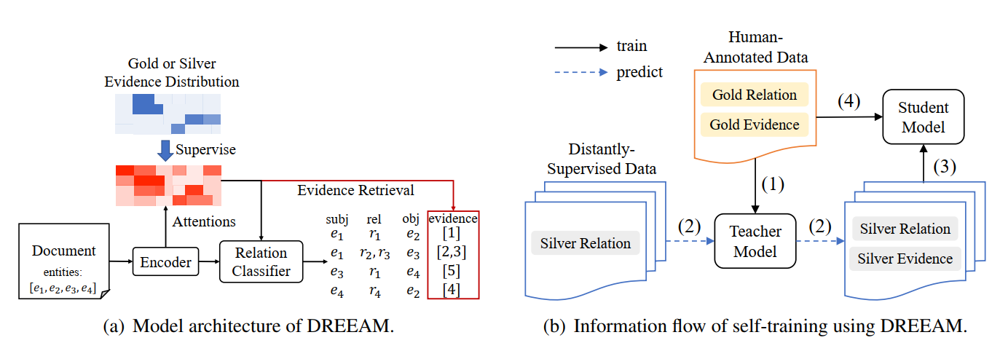
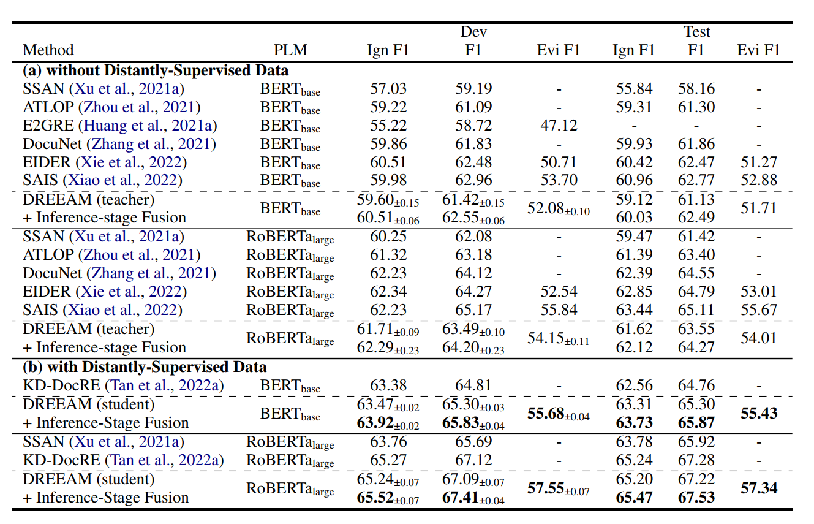
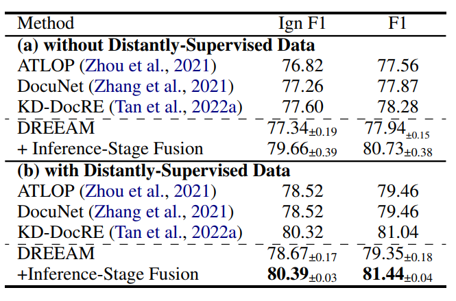
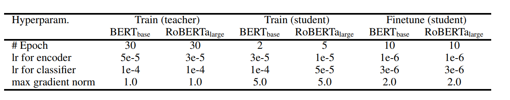
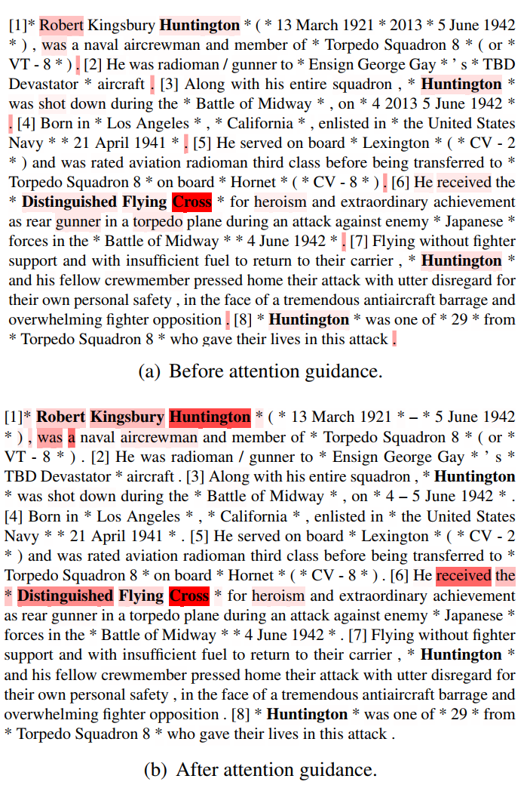

# DREEAM: Guiding Attention with Evidence for Improving Document-Level Relation Extraction  

DREEAM 使用证据引导注意力来改善文档级关系抽取 [^1]																							Translated by ： Drasick

## Abstract  

**文档级关系提取**(DocRE)：识别文档中每个实体对之间的所有关系的任务

**证据**：包含实体对之间关系的线索的句子（被证明可以帮助DocRE系统专注于相关文本，从而改善关系提取）

**证据检索**(evidence retrieval  ER)面临**两个主要问题**：高内存消耗和有限的注释可用性

因此为了提高证据检索的使用率，提出本文。

**DREEAM模型**：①记忆方法：使用证据信息作为监督信号，让各模块对于证据赋予高的注意力权重

​							②自我训练：在大量的自动生成的无证据注释的数据集上进行证据检索的训练

​							(作者说他是第一个采用自我训练的)

## 1. Introduction  

> 文档级关系提取(DocRE)具有与句子级别的任务相比，被认为是更现实和更具挑战性的任务。在DocRE的研究任务中，一个实体可以在整个文档中多次提及，并且不同句子中的实体之间可以存在关系。因此，DocRE模型有望将信息过滤应用于长文本，更多地关注与当前关系提取决策相关的句子，而减少对不相关的句子的关注。证据检索已有研究证明有效。
>
> 如下图所示，要确定Prince Edmund和Blackadder存在“正在创作”，阅读句子1和2就足够了。虽然句子5和6也提到了主语，但它们与关系决定无关。三元关系的证据(Prince Edmund，Present in work，lackadder)因此被定义为句子1和2。
>
> 尽管证据是有用的，但自动证据检索(ER)面临两个主要问题。
>
> 首先，现有的ER方法存在内存效率低的问题：以前的系统将ER和DocRE作为单独的任务处理，引入额外的神经网络层来联合DocRE学习ER。ER模块通常包含一个双线性分类器，该分类器接收实体对特定的嵌入和句子嵌入作为输入。为了计算每个实体对的每个句子的证据分数，模块必须遍历所有(实体对，句子)组合。计算显著增加了内存消耗，特别是在包含大量句子和实体的文档中。
>
> 其次，人类对证据的注释是有限的。更糟糕的是，DocRE的gold训练数据注释起来比句子级的训练数据更昂贵。尽管获取人工注释存在困难，但以低成本获取证据注释的研究还不够深入。虽然可以通过远程监督自动收集RE的silver训练数据的方法，但该方法在文档中定位一个RE实例的证据比较困难。

实体在主语和宾语上出现加粗表示，实体在其他位置出现就通过下划线表示。[i]表示这是第几句话。

### 证据检索的缺陷：

1. **内存利用效率低（遍历所有实体对和句子）**

   引入额外的神经网络层来**联合DocRE学习**，该神经网络层接收实体和句子embedding 计算两两组合的实体对 和每个句子的证据分数

2. **证据标注有限**

   DocRE的gold训练数据人工注释困难且昂贵。低成本获取证据注释的研究还不够深入

> 本文工作旨在缓解这些问题，以改善DocRE中ER的使用。为了减少内存消耗，我们提出了基于证据引导的注意力机制的文档级关系提取，这是一种将DocRE与ER结合起来的内存效率高的方法。我们采用了ATLOP作为核心架构（这是一种基于transformer的DocRE系统，在以前的研究中广泛使用）。我们没有引入外部ER模块，而是直接引导DocRE系统专注于证据。具体来说，我们监督实体对特定的局部上下文嵌入的计算。局部上下文嵌入，根据编码器的注意力在所有标记嵌入中形成加权和，训练的最终目标是为证据的句子分配更高的权重，而那些不是证据的句子则分配更低的权重。
>
> 为了弥补证据注释的不足，我们建议在弱监督设置下执行ER。具体来说，我们使用DREEAM在大量未标记的数据上执行自我训练。训练的数据来源于远端监督数据，该数据自动标注关系标签（不是证据标签）。我们期望从人类注释数据中学习到的关于ER的知识能够在远程监督数据上生成和增长。为了实现自我训练，我们首先采用一个经过人工注释数据训练的教师模型，从远程监督数据中检索silver证据。接下来，我们用RE的数据训练一个学生模型，同时从silver证据学习ER。学生模型在人工注释的数据上进一步进行微调，以细化其知识。DocRED基准的实验表明，在ER自我训练的帮助下，DREEAM在关系抽取（RE）和证据检索（ER）都SOTA了。

### 模型创新点

1. **取消联合学习，提高内存利用率**

   基于ATLOP架构来完成对于证据句子权重分配训练

2. **弱监督来弥补证据标注的数据不足** 

   教师-学生模型，教师模型通过人工注释数据训练，学生模型使用关系抽取数据训练。学生模型在教师模型指导下微调，来达到关系抽取和证据检索的能力增强。

> 在DocRED的任务上SOTA (RE: 80.730%)

## 2. Preliminary  

### 2.1 Problem Formulation

$$
文档：D
$$

$$
文档中的句子集合：\Chi_D = \{x_i\}^{|\Chi_D|}_{i=1}
$$

$$
文档中的实体集合：\xi_D = \{e_i\}^{|\xi_D|}_{i=1}
$$

每个实体至少在文档中出现过一次，对于每个实体再定义专有名词提及。
$$
专有名词提及：\Mu_D = \{m_i\}^{|\Mu_e|}_{i=1}
$$

$$
实体对关系：R_{s,o} \:\:about\: \:(e_s , e_o) \subset R
$$

$$
空关系： \epsilon \in R
$$

如果实体对之间存在非空的关系，该关系则拥有证据V。
$$
证据： V_{s,r,o} \subseteq \Chi_D
$$

### 2.2 ATLOP

使用PLM(BERT e.g.)得到embedding和cross-token，通过ATLOP模型的思路计算得到q（s，o）和LRE两个参数用于后续计算。

## 3. Proposed Method: DREEAM

> 为了执行信息过滤，ATLOP从Transformer-based encoder 获取attention weights，然后进行局部上下文embedding计算。
>
> 其基本原理是cross-token依赖是通过Transformer层中的attention weights 进行encode的。
>
> DREEAM 使用证据来增强ATLOP。
>
> 除了自动学习的cross-token依赖之外，注意力模块还被监督训练，以便注意力更多集中在证据句。
>
> dreamam既可以用于监督训练，也可以用于自我训练，共享具有不同监督信号的相同架构，如图2 (a)所示。受Tan等人(2022a)的启发，我们提出了一种实现ER自我训练的管道，其数据流如图2 (b)所示。首先，我们在具有黄金关系和证据标签的人类注释数据上训练一个教师模型。接下来，我们应用训练有素的教师模型来预测远程监督数据的银证据。然后，我们在远程监督数据上训练一个学生模型，ER由银证据监督。最后，我们在人工注释的数据上对学生模型进行微调，以细化其知识。本节的其余部分介绍了教师和学生模型的训练过程，然后是推理过程。

图（a）中的Gold or Silver证据分布分别来自人工的数据标注和老师模型的预测结果，图（b）表示数据的流动方式。

### 3.1 Teacher Model

对于实体对（s,o），定义q（s，o）帮助生成以证据为中心的局部上下文embedding。这个embedding对应的q（s，o）表达的是实体对的**token级别**的重要程度，但是**人工标记**中只能够得到句子级别的证据。为了**弥补**token级别和句子级别之间的**差异**，通过对于一句话中的所有token进行q的累加操作，从而将**token级别**的**q**得到**句子级别**的特征**p**。
$$
p_i^{(s,o)} = \sum_{j=START(x_i)}^{END(x_i)} q_j^{(s,o)}
$$
对于所有句子都可以求出对应的pi（s，o），从而表示每个句子对于这篇文章的重要程度。之后，对于每个实体使用**整体的p（s，o）**进行监督学习。p（s，o）通过gold证据数据计算人工标注的证据分布得到。

人工标注的证据分布步骤如下：

1. 首先定义**二元向量(**仅包含0，1)v（s,r,o） ，这个向量的长度和文档的句子的数量相同，如果这句话是这个关系r的证据，则这个向量中对应的位置标记为1，否则为0。

2. 1 然后，边缘化（计算概率边缘分布的那种边缘化）和标准化所有的向量v得到向量v（s，o）。

$$
v^{(s,o)} = \frac{\sum_{r\in R_{s,o}}  v^{(s,r,o)}}  {\sum_{r \in R_{s,o}} 1^T v^{(s,r,o)}}
$$

2. 2 **1**就是一个全1向量。**Why进行边缘化和标准化？**因为关系分类模块之前不能够识别出特定的关系类型，所以需要（标准化后）再通过有注意力机制的模块来生成**与关系无关的依赖项**（此时得到的v（s，o）去除关系r参数，**和r无关**）。此时得到的v即为人工标注的证据分布。

#### **上述思路总结：**

1. 需要得到一个基于证据的局部上下文embedding，因此既需要一个和句子内容有关的，又需要一个和证据有关的变量。
2. 引入q（s，o），但是q（s，o）只能够体现token级别的，所以通过一句话的所有token的q（s，o）累加得到p（s，o）
3. 引入v（s,r,o）来体现证据的含义，为了去除参数r，采用边缘化和标准化，得到v（s，o）
4. 此时得到了两个变量：p（s，o）体现了文档句子级别的信息，v（s，o）体现文档的句子级别的证据信息
5. 这时候就可以用于计算得到基于证据的局部上下文embedding了

#### **损失函数**

由上述得到的两个参数，要得到基于证据的局部上下文embedding，可以通过模型的KL散度损失的迭代计算，让p（s，o）和v（s，o）之间的差距逐渐减少，从而让文档句子级别的信息p（s，o）能够蕴含证据信息v（s，o）。
$$
L_{ER}^{gold} = -D_{KL}(v^{(s,o)} \:||\: p^{(s,o)})
$$
在训练过程中，对于证据搜索的损失影响程度和关系抽取的影响程度，通过超参数 λ 来进行平衡。
$$
L^{gold}  =  L_{RE}  + \lambda L_{ER}^{gold}
$$

###  3.2 Student Model

> 教师模型由上述可得，通过人工标注的数据进行训练。这个教师模型可以用于在大量数据上进行证据检索的自我学习。从关系远程监督数据集中获得的数据包含RE的噪声标签，但没有ER的信息。教师模型可以在这些数据上进行ER数据的生成，这些生成的ER数据将用于后续的学生模型的训练。为了区别**人工标注数据**和**教师模型预测的ER数据**，前者称为**gold数据**，后者称为**silver数据**。
>
> 学生模型和教师模型类似，由RE二元交叉熵损失（binary crossentropy loss）和ER自我训练损失组成。

由教师模型对于数据的预测得到的token级别证据分布记为 q^（s，o）。

#### **损失函数**

同理采用KL散度进行计算，学生模型token级别的KL散度损失计算公式如下所示。
$$
L_{ER}^{silver} = -D_{KL}(\hat{q}^{(s,o)} \:||\: q^{(s,o)})
$$
学生模型的q（s，o）计算过程同之前教师模型的计算过程相同。

#### **Lgold和Lsilver区别**

1. 首先，前者是**句子级**的，后者是**token级**的。

   这种差距由token分布的可用性导致。对于人工标注的数据，从句子级标注中获得token分布是很重要的。另一个角度，在教师模型的预测中可以很容易获得token上的证据分布。因此，我们采用token级证据分布，从更小的粒度监督ER自我训练。

2. 其次，Lgold的ER仅对具有**有效关系的实体对**进行计算，而Lsilver的ER则是对**文档中的所有实体**对进行计算。

   因为在远程监督数据上，许多关系标签可能是不相关的。因此，由教师模型**自动得到的数据**，**很难判断**哪些关系标签是**有用**的，哪些是**没有用**的。因此，我们计算所有实体对的损失，以**防止丢失**重要实例。

在训练过程中，对于证据搜索的损失影响程度和关系抽取的影响程度，也通过超参数 λ 来进行平衡。
$$
L^{silver}  =  L_{RE}  + \lambda L_{ER}^{silver}
$$
在学习完教师模型的信息后，再把gold数据投入到学生模型进行再次训练。从而，对学生模型进行**参数微调**，让它在文档级抽取和证据检索上都保持**稳定性**。

#### 关于预测

自适应阈值法获得RE预测，选择**得分高于阈值类**的关系类作为预测。

静态阈值法获得ER预测，并选择重要性高于**预定义阈值**的句子作为证据。

推理阶段融合策略，对于每个预测的三元组(es, r, eo)以及和它相关的V(s,r,o)的评估过程如下。

1. 创建伪文档D^(s,r,o)（这个伪文档只包括证据句子）。

2. 然后将伪文档D^(s,r,o)输入到训练好的模型中，来重新对关系三元组进行评分。

   为了能够聚合来自伪文档和整个文档的预测，我们采用了一个混合层，该混合层仅包含一个参数 τ ，表示阈值。只有当三元组的预测结果在整个文档和伪文档上的**分数之和大于 τ** 时，才选择这个结果作为最终预测。

3. 训练时，调整 τ 以最小化RE的二元交叉熵损失

## 4. Experiments

## 5. Conclusion & Limitations

>  我们介绍了在DocRE中改进ER使用的方法。首先，我们提出了一种内存高效的方法DREEAM，以降低ER的计算成本。与现有的为ER训练证据分类器的方法不同，dream直接监督注意力更多地集中在证据上。接下来，在弱监督环境中使用DREEAM，以弥补人工注释的不足。不直接采用人工标注的gold证据，而是采用经过人工标注数据训练的教师模型的预测的silver证据作为监督信号，实现对未标注数据的ER自训练。在DocRED-base上的实验表明，在对远程关系监督获得的数据进行弱监督训练的帮助下，dream在RE和ER上都表现出了SOTA的性能。与现有方法相比，dream在零可训练参数的情况下执行ER，能将内存使用减少至27%或更少。通过对DocRED的修订版Re-DocRED进行实验，也证实了DREEAM模型的可行性。
>
> 这项工作的一个主要限制是，只能检索关系不可知论的证据。DREEAM不能为每个关系标签指定证据句。因此，当一个实体对包含多个关系时，无论关系类型如何，dream都会检索相同的证据。然而并不是所有证据都会被某一个关系用到。

#### 优点

1. 将证据检索作用在注意力机制上，没有额外创建神经网络，减少内存消耗

2. 使用gold数据训练教师模型，再把数据通过教师模型预测得到silver数据，从而扩大训练数据的量，增强学生模型性能，完成SOTA

#### 缺点

​	实体存在多个关系，每个关系证据检索得到的结果相同，无法得知哪些证据是作用于该实体的特定的某种关系

#### 训练的超参数设定

#### 训练前后注意力变化

[^1]: [2302.08675v1.pdf (arxiv.org)](https://arxiv.org/pdf/2302.08675v1.pdf)

