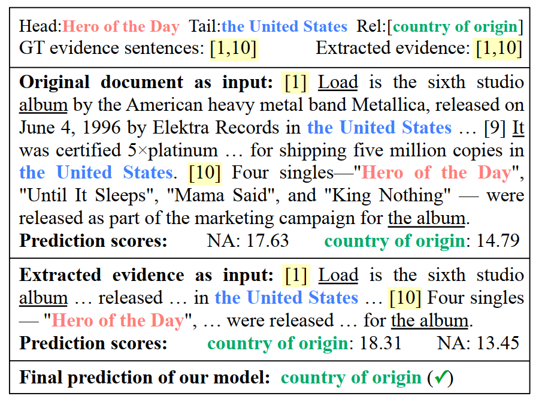
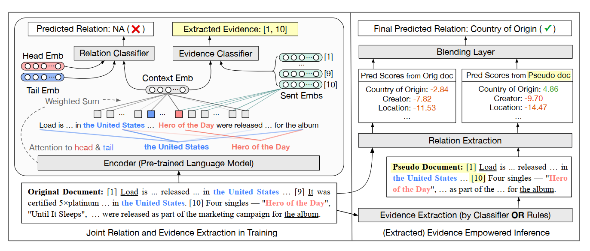
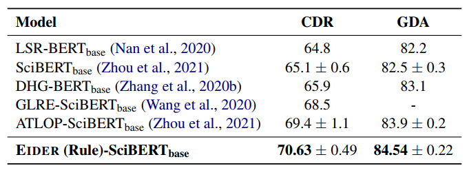
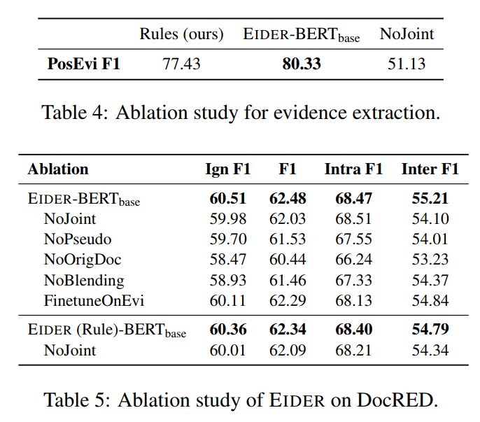

# EIDER: Empowering Document-level Relation Extraction with Efficient Evidence Extraction and Inference-stage Fusion    

EIDER：通过有效的证据提取和推理阶段融合增强文档级关系提取 [^1]														 			Translated by ： Drasick

## Abstract  

**文档级关系提取**(DocRE)：识别文档中每个实体对之间的所有关系的任务

典型的DocRE方法盲目地将整个文档作为输入，而文档中句子的子集(被标记为证据)通常足以让人类预测实体对的关系。

**EIDER证据增强框架**：通过有效地提取证据并有效地融合提取的证据来增强DocRE

**论文要点：**

​					① 轻量级的证据提取模型的设计与训练：内存和运行都是高效的

​					② 启发式规则设定：在silver标签训练数据模型也能够获得更好的RE性能

​					③ 推理过程设计：对提取的证据和完整的文档进行RE预测，然后通过混合层融合预测

​					④ DocRED f1:64.79 ign f1:62.85  CDR 70.63  GDA 84.54

## 1. Introduction  

> 关系提取(RE)是提取给定文本中实体之间的语义关系的任务。
>
> 以往的研究主要集中在预测单句中两个实体提及之间的关系。然而，在现实中，一个实体可能在整个文档中有多个提及。同样常见的是，一个关系只能在给定多个句子作为上下文的情况下推断出来。因此，最近的研究一直在朝着更现实的文档级关系提取(DocRE)设置。与盲目地将整个文档作为输入的典型DocRE模型不同，人类可能只需要**几个句子来推断实体对**的关系。对于每个实体对，我们定义了人类注释推断它们之间关系所需的最小句子集作为它们的证据句。
>
> 如图1所示，为了预测“Hero of the Day”与“United States”的关系，从第一句就可以知道Load(专辑)是在美国发行的，从第10句就可以知道“Hero of the Day”是Load的单句。换句话说，第1句和第10句作为推断这种关系的证据。虽然第9句也提到了“美国”，但它与这种具体关系无关。在输入中加入这些不相关的句子有时可能会给模型带来噪音，弊大于利。

图1：头尾实体涂色，实体在主语和宾语上通过下划线表示。[i]表示这是第几句话。[1,10] 作为证据就能够预测出关系

### 对于之前的文章进行说明

1. **Entity and evidence guided document-level relation extraction：**

   将证据句与RE一起提取，但提取后并未加以利用；

   需要人工注释的证据来进行训练，并且还需要大量的内存使用和训练时间。

2. **Three sentences are all you need: Local path enhanced document relation extraction：**

   仅在证据句子上训练RE模型，遗漏原始文档中的重要信息；

   与预训练的语言模型配对后体现不出性能的改进。

[^Huang 2021a]: Entity and evidence guided document-level relation extraction
[^Huang 2021b]: Three sentences are all you need: Local path enhanced document relation extraction

### 模型创新点

1. **DocRE数据集增强：**

   通过使用多任务学习联合**关系抽取**和**证据抽取**来增强DocRE，这使得两个任务能够相互提供额外的训练。

2. **更简单的证据提取模型**

   针对训练额外的任务而产生的内存和运行时开销：EIDER使用**更简单的**证据提取模型，单个GPU 95min的运行时间。

   ( 先前的多任务方法Huang 2021a 需要超过14小时和三个GPU来训练 )

3. **启发式规则设计**

   针对人工注释的证据句子成本很高：设计了启发式规则来构建silver标签；

   当使用银标签进行训练时，EIDER仍然可以提高RE性能，有时甚至可以与gold标签相当。

4. **利用证据来进一步增强**

   为了避免信息丢失，通过混合层将原始文档的预测结果和提取的证据融合在一起；

   EIDER更加关注提取的重要句子，同时仍然可以访问文档中的所有信息。

   ( 实证分析表明，去除原始文档的预测结果、或者提取的证据都会导致性能退化 )

   

> EIDER的改进在句子间实体对上最为显著，这表明利用证据在**多句推理**中特别有效。

## 2. Problem Formulation

### 2.1 Problem Formulation

$$
文档：d
$$

$$
文档中的句子集合： \{s_n\}^{N}_{n=1}
$$

$$
文档中的token集合： \{h_l\}^{L}_{l=1}
$$

$$
文档中的实体集合： \{e_i\}^{E}_{i=1}
$$

如果头尾之间存在关系，记为正样本，否则记为负样本。
$$
正负样本： P^T_{h,t}  \:\:\:\:N^T_{h,t}
$$

如果实体对之间存在非空的关系，该关系则拥有证据句子集V。
$$
证据： V_{h,t} = \{s_{v_k}\}^{K}_{k=1}
$$

## 3. Methodology  

> EIDER框架的图示如图2所示。在训练中，使用多任务学习共同提取关系和证据，两个任务有自己的**分类器并共享基础编码器**。
>
> 在推理中，使用**混合层**融合原始文档和提取的证据的预测。
>
> 在证据注释不可用的情况下（某些数据集并未标注证据是哪几句），使用启发式规则来构建silver证据标签作为替代方案。

图2：EIDER的整体架构。左图为训练阶段，右图为推理阶段。我们突出头部实体、尾部实体并提取证据。

### 3.1 Joint Relation and Evidence Extraction  

#### Base Encoder

在每个实体前后加入 “*”  然后使用预训练模型进行编码。

H 是整篇文章的token embedding ；A 是transformer最后一层attention平均值：
$$
d = \{h_l\}^{L}_{l=1}
$$

$$
H,A = Encoder([h_1,..., h_L])  \:\:\:\: A \in R^{L \times L}
$$

使用“*” 的embedding 作为实体embedding的信息m，每个实体的mention embedding为涉及到的所有m之和：
$$
e_i = log \sum_j exp(m^i_j)
$$
利用注意力矩阵 A 的形式和 H 来作为上下文信息：
$$
c_{h,t} = H^T \frac{A_h \circ A_t}{A_h^T A_t}
$$
头尾节点的注意力矩阵A由全文的A和e的mention embedding进行平均得到。

( 直觉是，mention embedding对两个实体都很重要，并且应该对上下文嵌入做出更多贡献。)

#### Relation Classifier  

为了预测实体对(eh, et)之间的关系，通过将它们的实体嵌入(eh, et)与上下文嵌入相结合来计算它们的上下文感知表示(zh, zt)，然后利用双线性函数来计算eh和et之间存在关系r的可能性的对数：
$$
z_h = tanh(W_h e_h + W_{c_h}c_{h,t})
$$

$$
z_t = tanh(W_t e_t + W_{c_t}c_{h,t}),
$$

$$
y_r = z_h W_r z_t + b_r
$$

其中的各个W都是训练中的参数。由于模型对不同的实体对可能具有不同的置信度，采用自适应阈值损失( 参照之前的ATLOP )，它学习一个关系类TH，作为每个实体对的动态阈值：
$$
y_{TH} = z_h W_{TH} z_t + b_r
$$
对于一个三元组关系的预测结果，都与该动态阈值进行比较，得到预测分数：
$$
S_{h,t,r}^{(O)} = y_r - y_{TH}
$$
最后定义关系抽取的Loss：
$$
L_{RE} = -\sum_{h \neq t} \sum_{r \in P^T_{h,t}} log(\frac {exp(y_r)} {\sum_{r' \in P^T_{h,t}\bigcup {\{TH\} } } exp(y_r')}) - log(\frac {exp(y_{TH})} {\sum_{r' \in N^T_{h,t}\bigcup {\{TH\} } } exp(y_r')})
$$

#### Evidence Classifier 

除了关系外，我们还预测了每个句子s是否是实体对的证据句。与实体嵌入类似，为了获得句子嵌入s，对涉及的句子进行加权求和：
$$
s_n = log \sum_{h_l \in s_n} exp(h_l)
$$
直观地说，如果sn是一个证据句，则将与关系预测相关，并且对注意力和上下文提供贡献。因此，可表达为：
$$
P (s_n|e_h, e_t) = σ (s_nW_vc_{h,t} + b_v)
$$
W和b是对应的训练参数。对于一个实体对可能存在多个证据句，因此对于多个证据句之间采用二项交叉Loss来代入训练：
$$
L_{Evi} = - \sum_{h \neq t  \: NA \in P^T_{h,t}}  \sum_{s_n \in D} y_n \cdot P (s_n|e_h, e_t) + (1-y_n )\cdot log(1-P (s_n|e_h, e_t))
$$
其中，如果句子属于证据集，则标签为1，否则为0。如果没有提供gold标签，则使用启发式规则来构造silver标签。
最后，结合关系提取损失和证据提取损失对模型进行优化:
$$
L = L_{RE} + L_{Evi}
$$

> #### * Efficiency Considerations
>
> 实验表明，EIDER在RE和证据提取方面的性能都优于E2GRE，而其内存占用率仅为E2GRE的30%，运行时间仅为E2GRE的11%。

###  3.2 Fusion of Evidence in Inference  

> 假设提取的证据句已经包含了与关系相关的所有信息，那么就不需要使用整个文档进行关系提取。然而，没有一个系统可以完美地提取证据而不遗漏任何句子。仅仅依赖提取的证据可能会错过文档中的重要信息，导致性能不佳。因此，将**原始文档和提取的证据的预测结果结合**起来，如果证据注释不可用，这些结果可以由证据分类器学习，也可以由启发式规则构建。
>具体而言，如图2所示，首先从原始文档中获得一组关系预测分数 S 。然后，按照原始文档中的顺序将提取的证据句子连接起来，为每个实体对构建一个伪文档。RE模型对伪文档的预测得分记为新的 S 。最后，我们通过一个混合层聚合两组预测值来融合结果。

将根据**原文档**预测的关系结果 S(O) 和通过训练的证据抽取器( 或者启发式规则 )得到的只有证据的**伪文档**的关系预测结果 S(E) ，通过混合层来进行融合得到最终的关系预测结果：
$$
P_{Fuse} (r|e_h, e_t) = σ(S_{h,t,r} ^{(O) }+ S_{h,t,r}^{ (E)} - τ)
$$
该设计简单，且含可学习的参数 τ ，减轻dev 数据集过拟合。对dev 数据集的参数 τ 的Loss计算：
$$
L_{Fuse} = - \sum_{d \in D} \sum_{h \neq t} \sum_{r \in R} y_r \cdot P_{Fuse} (s_n|e_h, e_t) + (1-y_r )\cdot log(1-P_{Fuse} (s_n|e_h, e_t))
$$
yr 也是二值，如果存在关系r就为1，否则为0。

### 3.3 Heuristic Evidence Label Construction  

> 在无法对证据进行人工标注的情况下，设计启发式规则来自动构建用于证据提取的silver标签。然后在silver标签上训练联合模型，直接使用silver标签作为伪文档进行推理。表6显示了每条规则所覆盖的测试样本的百分比。

#### Co-occur

如果头部和尾部实体在同一个句子中共同出现，使用它们共同出现的所有句子作为证据。

#### Co-ref

如果头部和尾部实体的专有名词提及没有同时出现，但它们的共指性提及同时出现( 例如，“Hero of the Day” 和 “the album”，“Load” 的共指性提及在图2的第10个句子中同时出现)，使用它们的共指性提及同时出现的所有句子作为证据。

#### Bridge

如果不满足前两个条件，则存在第三个桥实体，或者它的共指提及与头和尾同时出现(例如，“Load”或它的共指提及“the album”与图2中的“United States”和“Hero of the Day”同时出现)，我们将桥与头或尾同时出现的所有句子作为证据。如果有多个桥实体，我们选择频率最高的一个。虽然这条规则可以很容易地扩展到多个桥，但根据经验观察到，捕获一个桥已经产生了令人满意的结果。

## 4. Experiments

CDR：生物医学领域的人类标注的化学疾病关系抽取数据集，由500份文档组成，该数据集的任务是预测化学和疾病概念之间的二元相互作用关系。

GDA：生物医学领域的一个大规模数据集，它包含29192篇文档以供训练，其任务是预测基因和疾病概念之间的二元相互作用。

消融实验

## 5. Conclusion

联合**关系抽取**和**证据提取**以及**推理中提取证据的融合**来改进DocRE关系抽取是有效的。

不依赖于人类对证据的注释。

在推理过程中，将原始文档和提取的证据的预测结果结合起来，鼓励模型关注重要的句子，同时减少信息损失。

EIDER在三个公共数据集(DocRED、CDR和GDA)上显著优于现有方法( 当时，现在排在第5)，尤其是在句间关系上。

[^1]: [2106.08657v2.pdf (arxiv.org)](https://arxiv.org/pdf/2106.08657v2.pdf)

