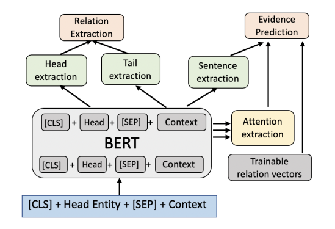
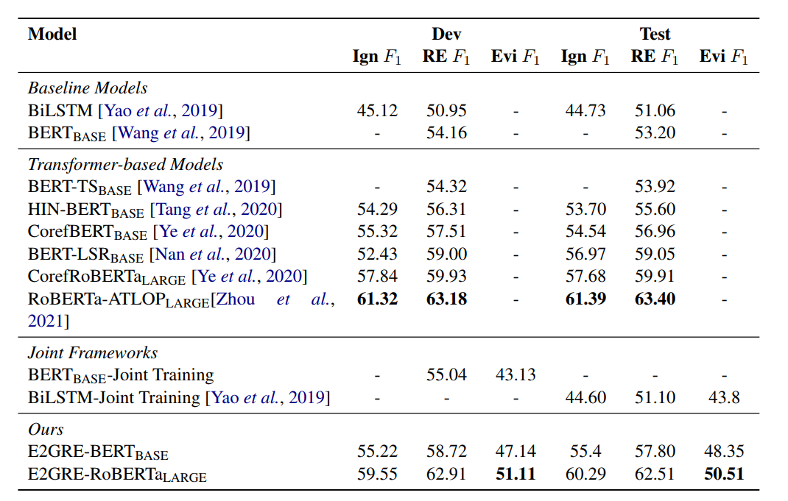
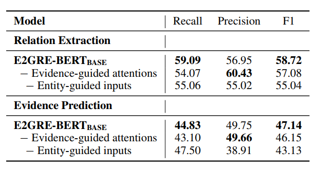
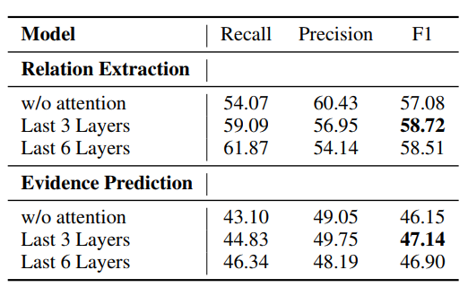

# Entity and evidence guided document-level relation extraction    

实体和证据引导的文档级关系提取                                          																						Translated by ： Drasick

## Abstract  

**文档级关系提取**(DocRE)：需要对多个句子进行推理，以预测文档中的一组关系

**模型框架**：E2GRE (Entity and Evidence Guided Relation Extraction)

​					① 使用预训练语言模型(LM)作为input encoder，共同提取关系和底层证据句子

​					② 使用证据预测的附加特征来引导预训练LM的注意机制关注相关上下文

​					③ 文档文本与头部实体连接起来，让预训练模型专注于与头部实体更相关的文档部分

## 1. Introduction  

> 文档级关系提取(DocRE)具有与句子级别的任务相比，被认为是更现实和更具挑战性的任务。在DocRE的研究任务中，一个实体可以在整个文档中多次提及，并且不同句子中的实体之间可以存在关系。因此，DocRE模型有望将信息过滤应用于长文本，更多地关注与当前关系提取决策相关的句子，而减少对不相关的句子的关注。证据检索已有研究证明有效。
>
> 除了从文档中提取实体关系之外，突出显示系统用来预测它们的证据通常也很有用，以便人类或第二个系统可以验证它们的一致性。更重要的是，证据预测可以通过限制模型对正确上下文的关注来潜在地补充RE性能。在初步实验中，我们发现当前模型在训练时仅保留金证据句子，并且仅对金证据句子进行评估，从而能够在DocRED上实现约87%的RE F1，这是对当前DocRED排行榜RE F1数字(约63% RE F1)的显着改进。然而，证据预测是一项具有挑战性的任务，大多数现有的关系提取方法完全忽略了证据预测的任务。
>
> 关系提取的最新方法是对大型预训练语言模型(LMs)进行微调(例如BERT，RoBERTa )作为输入编码器。然而，将预训练模型用于文档级RE面临着一个限制其性能的问题：由于给定文档的长度，文档级中存在比句子内更多的实体和关系。预训练模型必须同时编码关于所有实体对的信息以进行关系提取，这使得任务更加困难，并且限制了预训练模型的有效性。
>
> 本文提出了一个新的框架:实体和证据引导关系提取(E2GRE)，它共同解决了关系提取和证据预测的问题。对于证据预测，我们将预训练的LM作为input encoder，并使用其内部注意概率作为附加特征来预测证据句子。因此，我们使用支持证据句来直接监督LM在调优期间应该关注哪些token，这反过来有助于改进联合训练框架中的关系提取。为了进一步帮助LM关注长文档中更小的相关单词上下文集，我们还引入了实体引导的输入序列作为这些模型的输入，方法是将每个头部实体一次一个地附加到文档文本中。这允许LM编码器显式地对涉及特定头部实体的关系建模，同时忽略所有其他实体对，从而简化了LM编码器的任务。联合训练框架帮助模型定位每个关系预测所需的正确语义。
>
> 我们提出的E2GRE框架是一种简单的联合训练方法，它有效地结合证据预测的信息来指导预训练的LM编码器，从而提高了关系提取和证据预测的性能。
>

​                                                                                         头尾实体 关系 以及证据句索引

### 模型创新点

1. **实体与文档连接，作为输入序列进行encoder**

   为预训练的语言模型生成多个实体引导的输入数据：对于每个文档，将每个实体与文档连接起来，并将其作为输入序列进行编码。

2. **使用预训练LM的internal attention probabilities进行证据预测** 

3. **E2GRE联合训练框架**

   在实体和证据的指导下，提高了关系提取和证据预测的性能，表明这两个任务是相互有效促进的。

   

## 2. Related Work  

早期：使用特征从统计学方法解决

后来：CNN LSTM 来进行语义关系的捕获

再后来：在前者基础上增加额外层—— 

​						① 使用分层关注从粗到细的语义关系；

​						② 在剪枝依赖树的基础上构建GCNs，得到注意力的AG-GCNs；

缺点：在文档级抽取上表现较差

文档级抽取： 许多方法基于图的神经网络——

​						① 针对n元文档级任务，提出以实体为中心的多尺度特征学习（基于实体/句子/文档的LSTM模型）；

​						② 面向边缘的图模型；

​						③ 诱导潜在图；

​						④ 面向DocRED的显式异构图；

针对多实体多标签问题： ATLOP 自适应阈值

预训练编码：预训练LM提供潜在信息

**思路**：在预训练LM的基础上，通过实体和证据指导，提高预训练的LM在文档级关系提取方面的有效性。

## 3. Method  

### 3.1 Entity-Guided Input Sequences  头尾关系预测

训练输入：

​		“[CLS]”+ H +“[SEP]”+ D +“[SEP]” 

​		H指的是头实体第一次被提起的token

​		D指的是文章整体的tokens

因此对于文章的Ne个实体，就会有对应的Ne个输入。将Ne个输入喂给BERT——这样就可以得到头实体的embedding和剩下的所有实体的embedding（合起来作为一组尾实体的embedding）

每一次训练对应的要预测Ne-1个关系对

将Ne个embedding输入到具有sigmoid激活函数的双线性层中，预测头部实体h与每个尾实体之间的每种关系的概率
$$
\hat{y}_{ik} = δ(h^{T} W_it_k + b_i)
$$
i 表示第i种关系，k表示第k个实体，δ是sigmoid函数，W和b是学习参数。

轮流将Ne个实体作为头实体，就能够得到这个文章中所有实体（在作为头实体的情况下）的关系预测。

### 3.2 Evidence Guided Relation Extraction  

#### 3.2.1 证据预测

Ns 作为文档的句子数

句子的embedding： 整个句子中所有词通过BERT得到的embedding取平均

关系的embedding：随机初始化，通过学习来不断修正
$$
F^i_{jk} = s_j W^r_i r_i + b^r_i
$$

$$
\hat{y}^{i}_{jk} = δ(F^i_{jk} W^r_o + b^r_o)
$$

sj 指的是第 j 个句子的embedding，W和b和之前一样是训练参数。

对于第 k 个尾实体，对于第 j 个句子，该句子对于第 i 个关系，可以计算出 F 值，再将这个 F 值通过sigmoid得到这个句子对于第 i 种关系的可能性的预测。

对应的第 i 种关系的损失：
$$
L_{Evi} = -\frac{1}{N_e - 1} \frac{1}{N_s} \sum_{k = 1}^{N_e - 1} \sum_{j = 1}^{N_s} (\:y^{i}_{jk} \:\:log(\hat{y}^{i}_{jk}) + (1- y^{i}_{jk}) \:log(1- \hat{y}^{i}_{jk})\:)
$$
y没有hat的那个，表示第 j 个句子是否是关系 i 的证据句子的真实结果。取值为1或者0。

#### 3.2.2 联合训练损失基本模板

$$
L_{baseline}  =  L_{RE}  + \lambda *L_{Evi}
$$

#### 3.2.3 在证据预测中引入注意力机制

对于每一对头部h和尾部tk，引入BERT最后一层的attention probabilities帮助证据预测。

Nh 注意力头的数量（BERT是12个）

L是输入句子的长度（设定为1024）

d是embedding 维度（BERT默认是768）

A：对于一个文档，可以得到对应的多头注意力矩阵输出（12 * 1024 * 1024） 
$$
Attention = \frac{ softmax(QK^T) }{ \sqrt{ d / N_h}}
$$

$$
Att-head_i = Attetion(QW_i^Q, KW_i^K)
$$

$$
A = Concat(Att-head_1, ..., Att-head_n)
$$

以上就是 BERT 里面计算得到 A 的过程。

采用BERT最后的 l 层的 所有A 作为 Ak 。即注意力为 l * 12 * 1024 *1024

对于每一层 使用 maxpooling （因为最大值说明最有可能在关注什么）

然后对于每一层的关注进行平均 记为 As，公式写为如下：
$$
\tilde{A_s} = \frac{1}{l} \sum_{i=1}^l maxpool(\tilde{A}_{ki})
$$
As 的维度为 1024 *1024

然后对于头尾实体的起始结束位置的所有位置在As中得到的所有注意力概率进行平均，记为Ask

比如头的pos是（3，5） 那么就是1024*1024 中对应的第3到5行的所有对应位置的值相加除以3

此时Ask的维度就是 1024

对于一个句子，就把这个句子的pos对应的所有词进行相加平均。

比如句子是从（3，11） 就把1024*1024 中对应的第3到11行的所有对应位置的值相加除以8

这样子对每个句子都进行操作就可以得到 ask ，维度为对应的句子数量Ns。

然后，把之前的F通过一个transformer来鼓励句子间的相互作用，并形成新的表示 Z 。使用 Z 和上述得到的 ask来进行证据预测。
$$
\hat{F}^i_{jk} = s_j W^r_i r_i + b^r_i
$$

$$
\hat{Z}^i_{jk} = FFN(LayerNorm(Multi-Head(\hat{F}^i_{jk})))
$$

$$
\hat{y}^{ia}_{k} = δ(a_{sk} \: W^a_i \: \hat{Z}^i_{k} + b^a_i)
$$

对应的Loss计算：
$$
L_{Evi}^a = -\frac{1}{N_e - 1} \frac{1}{N_s} \sum_{k = 1}^{N_e - 1} \sum_{j = 1}^{N_s} (\:y^{ia}_{jk} \:\:log(\hat{y}^{ia}_{jk}) + (1- y^{ia}_{jk}) \:log(1- \hat{y}^{ia}_{jk})\:)
$$
没什么区别，就是 y^hat 的计算套了一层Z之后变成 yia^hat 了。

#### 3.2.4 联合训练损失

$$
L_{E2GRE}  =  L_{RE}^e  + \lambda_a *L_{Evi}^a
$$

## 4. Experiments

学习率 = 1e-5

λa = 1e-4

关系向量 dimension = 108

消融实验

选取几层注意力layer用于注意力抽取

## 5. Conclusion & Limitations

>  在本文中，我们提出了一个简单而有效的联合训练框架E2GRE (Entity and Evidence Guided Relation Extraction)，用于DocRED的关系提取和证据预测。为了更有效地利用预训练的LM进行文档级RE，我们首先生成新的实体引导序列输入LM，将模型的注意力集中在文档中的相关区域。然后，我们利用从最后几层提取的内部关注来帮助引导LM关注相关句子进行证据预测。我们的E2GRE方法提高了RE和证据预测的性能。我们表明，证据预测是帮助RE模型更好地执行的重要任务。

实体引导输入 有效

使用attention layer进行证据预测的指导 有效

选取最后3层 layer效果比较好

