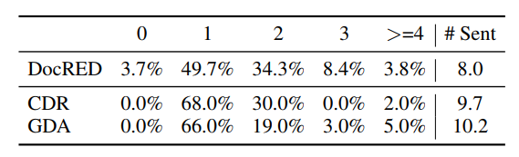
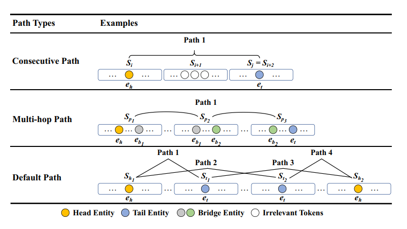
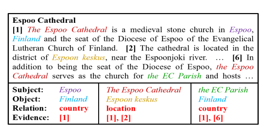
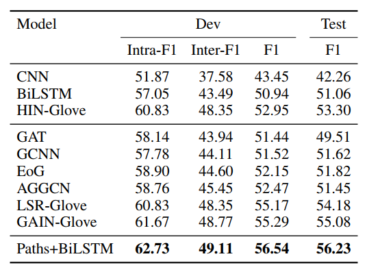

# Three sentences are all you need-Local path enhanced document relation extraction

只需三句—局部路径增强的文档关系提取								                           														Translated by ： Drasick

## Abstract  

**文档级关系提取**(DocRE)：识别文档中每个实体对之间的所有关系的任务

背景：人类标注数据往往通过少量的句子来识别给定实体对之间的关系

思路：非常简单但有效的方法来启发式规则，选择文档级证据句子

## 1. Introduction  

> 关系抽取是文本实体对之间关系的抽取，在信息抽取中起着重要的作用。而早期的工作专注于提取句子中的关系，最近的研究开始在文档级探索关系抽取，这更具挑战性，因为它通常需要跨多个句子进行推理。
>
> 与句子级提取相比，文档明显更长，有用信息分散在更大的范围内。然而，给定一对实体，人类可能只需要几个句子，而不是整个文档，就可以推断它们的关系；阅读整个文档可能没有必要，因为它不可避免地会引入不相关的信息。这自然导致我们考虑一个问题：给定一个实体对，需要多少句话来识别它们之间的关系？我们对3个广泛使用的文档RE数据集DocRED、CDR和GDA进行了试点研究。如下表所示，我们发现超过95%的实例需要不超过3句话作为支持证据，87%的实例甚至只需要2句或更少的支持证据。
>
> 我们的初步发现表明，与其将整个文档作为上下文，特定案例的选择可能更有助于模型关注最相关和最翔实的证据。先前的研究将图神经网络(GNN)应用于该过滤过程。在这里，GNN通过聚合方案从整个上下文中收集相关信息，并取得了很好的性能，但从文档中选择关键证据仍然是隐式的，缺乏可解释性。如果正如我们的初步研究所表明的那样，大多数实体关系可以只用1 ~ 3个证据句子来确定，那么是否有一种更简单的方法可以在保持关键数据的同时，明确地过滤文档？

​																						数据集中的证据句子的比例分布表

**阅读整个文档没有必要**，信息集中在少数的几个证据句子中。

因此如何选取合适的方式，保证关键证据，并且对长文本进行过滤？

多个证据句子的相似点：倾向于选择可以连接两个实体的句子——**为证据句子构建路径**。

#### 启发式规则

​		① 连续路径：考虑了头尾实体在**上下文中接近**的情况:如果它们在3个连续的句子内，我们将这些句子视为一条路径。

​		② 多跳路径：远端句子中的实体对（头尾离得比较远），通过与不同句子中的头实体和尾实体同时出现的其他实体来桥接。

​		③ 默认路径：如果不接近，并且找不到桥接的实体，那么就直接把所有出现头尾的句子都**头—尾**连接在一起

​																			 连续路径 多条路径 默认路径 示例图

将路径集与人工注释的支持证据进行比较，我们发现我们的启发式选择的路径可以**完全覆盖高达87:5%**的支持证据。

## 2. Do we need the entire document?    

> 对于文档级RE，主要的挑战是关系中的主语和宾语可能出现在不同的句子中。因此，需要不止一个句子来捕捉这些关系。尽管如此，从整个文档中需要多少个句子来识别实体对之间的关系？为了解决这个问题，我们分析了DocRED中提出的支持性证据。关系实例的支持证据是指所有可以用来决定实体对之间是否存在这种关系的句子，由人类注释者标记。
>
> 表1显示了具有不同支持句数的实体关系实例的比例。可以看出，超过96%的DocRED实例与最多3个支持性证据有关。由于平均文档长度为8个句子，3个句子平均占文档的37.5%篇幅。这意味着读取文档的一小部分就足以识别实体关系实例。
>
> 我们进一步将研究扩展到两个广泛使用的文档RE数据集，CDR 和GDA，其中CDR是手动构建的，GDA是远程监督的。为了找到所需的最少数量的句子，我们要求注释者标记一组足以识别实体关系实例的最小句子。我们分别从CDR和GDA中随机选择100个实例进行进一步注释，结果如上表底部所示。
>
> 虽然GDA和CDR中文档的平均长度比DocRED长，但事实证明，人们仍然可以使用不超过3个支持句来识别95%以上的实体关系实例。CDR和GDA上的结果证实了我们之前的发现，在广泛使用的基准数据集中，很少的句子(或者更确切地说，不超过3个句子)就足以让人类注释者识别文档中几乎所有的实体关系实例。

**主要的挑战**：关系中的主语和宾语可能出现在不同的句子中。

对于DocRED、CDR和GDA三个数据集进行分析，在广泛使用的数据中，很少的句子**(或者更确切地说，大部分不超过3个句子)**就足以让人类注释者识别文档中几乎所有的实体关系实例。

## 3. Which sentences are decisive?  

> 现在我们的问题是如何选择足以识别实体关系实例的支持句。
>
> 直观地说，支持证据应该是在一对实体之间建立联系的句子。
>
> 因此，我们的目标是提取从头部实体到尾部实体的句子路径，以描述它们是如何连接的。
>
> 对于最简单的情况，如果存在一个同时包含头尾实体的句子，则该句子本身可以被视为一条路径(句内情况)。
>
> 对于头部和尾部实体不同时出现在一个句子中的更复杂的情况，我们定义了以下3种类型的路径，以指示头部和尾部实体如何在上下文中可能相关。上图提供了三种类型路径的可视化。

#### 连续路径

以往的研究表明，大多数句间关系往往在**附近的文本**中。

因此，当头尾实体在相邻的句子中时，选择连续的句子来形成一条路径。

如果在句子 Si 中提到一个头部实体，在句子 Sj 中提到一个尾部实体，那么这两个句子以及中间的句子形成连接两个实体的可能路径。

假设不超过 3 个句子足以进行推理，限制这些连续路径的长度最多为 3，这意味着 j - i ≤2。当 j - i =0，即头尾实体在单句内，这种简单的情况也是属于连续路径。

一对实体可以对应多个连续路径，因为它们可以被提及多次。

#### 多跳路径

句子间关系实例的另一个典型案例是多跳关系。

在这种情况下，文档中的头尾实体彼此相距很远，但可以通过桥实体连接起来。

（例如，实体 **the Espoo Cathedral **在第1句和第6句中将 **EC Parish** 和 **Finland** 连接起来）

对于这些情况，从头实体出发，经过所有桥实体，到达尾实体，并选择该路径中所有对应的句子作为路径。

对于头部实体eh和尾部实体et，多跳关系表明存在一个桥接实体列表：**(eh，eb1)， (eb1，eb2)，...... ，(bk+1，et)**

选择这k +1个句子作为多跳路径。因为大多数实例只需要3个句子，限制 k 最多为2，即只有1或2个桥实体。

对于具有**不同桥接实体列表**的特定对，可能有多个多跳路径。

#### 默认路径

如果上述规则都不适用，考虑对最相关句子的证据进行粗略估计。

我们收集所有的句子对，其中一个包含头部实体，另一个包含尾部实体作为默认路径。

{Sh1，... , Shp} 和 {St1，... , Stq}分别表示包含头部实体 eh 和尾部实体 et 的句子集。

对于所有的句子进行两两头尾组合，只有在前两种模式中**没有找到路径**时，才会采用这种类型的路径。

## 4. Comparing with Annotated Evidence  

为了证明启发式规则的有效性，比较在DocRED构建的路径集和支持证据集的一致性。

使用支持证据的覆盖率来衡量路径集的充分性，它表示支持证据被路径联合完全覆盖的实例的百分比。

C 表示采用连续路径的方法 M表示采用多跳路径方法 D表示采用默认方法 #Sent是句子的平均长度，#Path是路径的平均长度。

通过规则提取的路径集的统计信息。连续路径覆盖了71%的实例。结合这三种类型，多达87:5%的支持性证据实例被路径集完全覆盖。

C + M + D 不能涵盖所有实例的主要原因是DocRED注释的**支持证据包含了所有关联的句子**，而**C + M + D只找一个充分集**来识别关系。

同时，请注意，三种类型的联合平均句长为2.69，这意味着最多可以过滤掉2/3的原始文本。

此外，该方法**计算效率很高**，因为平均只有2.27条路径需要建模。

这表明该启发式规则形成了**充分和非冗余**的估计，**大大减轻了不相关信息的负面影响**。

## 5. Experiments  

> 为了进一步验证选择的路径的充分性，将路径提供给RE模型来对DocRED进行评估。
>
> 虽然以前的工作将**整个文档作为输入**，但这里将文档替换为针对给定**实体对的选择路径**。直观地说，如果路径可以覆盖文档中的所有关键信息，我们将期望使用相同的模型体系结构获得可比或更好的性能，因为我们的路径包含很少的无关信息，并且可能有助于关注几个关键句子。

#### 数据处理

给定一对实体，首先提取所有路径。由于每条路径对应于头尾实体的一个可能连接，我们独立地**预测与每条路径的关系**，然后汇总结果。

路径记为 c ——每条路径的形式为：
$$
[w_1^c , w_2^c , ... , w_m^c]
$$
通过encoder（i.g. BiLSTM）得到对应的embedding序列：
$$
[w_1^c , w_2^c , ... , w_m^c]
$$
对于每个实体的注意力的计算（假设实体是从第 s 个词到第 t 个词的长度）：
$$
m_k^c = \frac{1}{t-s+1} \sum_{j=s}^{t}{h_j^c}
$$
一个实体可能在多个地方提及，那就会有多个注意力，对于所有注意力进行平均，作为实体的注意力：
$$
e_i^c = \frac{1}{K} \sum_k{m_k^c}
$$
然后使用每个实体的注意力来进行头尾关系的预测，对于第 i 个实体 和第 j 个实体之间采用两层layer的感知器进行计算：
$$
P^c_{ij}(r) = σ(F([e_i^c \: ; e_j^c \: ; | e_i^c - e_j^c| \: ; e_i^c * e_j^c]))
$$
其中 σ  是 sigmoid 函数，F 就是代表两层layer的感知器，其中输入的参数有第 i 个实体 和第 j 个实体的注意力，第 i 个实体 和第 j 个实体的相对距离，以及第 i 个实体 和第 j 个实体的点积。

对于两个实体之间可能存在多个路径，此时选取最大值最为最后的关系预测结果：
$$
P_{ij}(r) = max_c \: P^c_{ij}(r)
$$

#### 路径用于DocRED结果

之前的模型都将整个文档作为输入。

如表3所示，选择的带有BiLSTM的路径在测试集上达到了56.23% F1，优于基于序列的模型。与基线BiLSTM相比，模型在开发集上的句内实体对和句间实体对分别提高了5.68%和5.62%。并且和基于图的模型相比，也达到很好的效果。

## 6. Discussion  & Conclusion   

#### 为什么启发式规则是可行的？（而不是一种非常规，取巧的方式）

**语言学的角度**

所讨论的现象的一个可能的原因是，鉴于它们的语言形式，看似遥远的关系并不那么困难。

大多数**句间关系**实例实际上是由于**共同引用(回指表达或替代描述)**。在这些情况下，关系可以被认为完全在一个句子中描述，但头部或尾部实体被间接提及。考虑到**回指表达可能出现在候选提及的周围句子**中，这些发现直接符合观察，即连续路径可以支持70%以上的关系实例，并为三句现象提供证据。

**认知的角度**
另一种可能的解释是，考虑到人类大脑的本质，关系抽取任务自然是在有限数量的实体和上下文中定义的。

人们普遍认为，工作记忆(Working Memory, WM)在推理任务中对信息的存储和操作起着至关重要的作用，但工作记忆中独立信息块的容量往往被限制在4个。

由于我们需要记住推理链中所有独立的实体及其关系，因此我们倾向于在有限数量的句子中描述关系是很自然的，因为用更多的句子来呈现关系可能会导致我们的WM超出其容量。Daneman和Carpenter(1980)的研究表明，如果**阅读任务需要的信息过多**，超过了受试者的认知能力，那么**完成阅读任务的成功率会急剧下降**。因此，由于数据集是由自然语言构建的，数据中的**三句话现象可能是我们(无意识地)**为了**相互理解而遵循**的共同模式。

**总结**

​		① 通过对于数据集观察，可以发现少量句子就能够实现文档级关系抽取；

​		② 启发式规则来对文章进行有效信息抽取，获得信息路径集；

​		③ 效果比传统的方式好。
