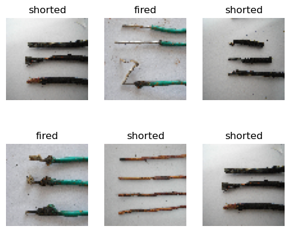

## 1. 导入包


```python
import tensorflow as tf
from tensorflow.keras.models import Sequential
from tensorflow.keras.layers import Dense
import sklearn
import numpy as np
import cv2
import os
```

## 2. 载入数据

### 2.1 更换图片文件名称


```python
# import os

# def rename_jpg_files(folder_path):
#     # 切换到指定文件夹
#     os.chdir(folder_path)
#     # 获取文件夹中所有文件的列表
#     files = os.listdir()

#     # 初始化计数器
#     count = 1
#     # 遍历文件列表
#     for file in files:
#         # 判断文件是否是jpg文件
#         if file.endswith(".jpg"):
#             # 构造新的文件名
#             new_file_name = str(count) + ".jpg"
#             # 重命名文件
#             os.rename(file, new_file_name)
#             # 计数器加1
#             count += 1
            
# folder_path = "./firefighting/shorted"
# rename_jpg_files(folder_path)
```

### 2.2 读取图片


```python
def load_img(indir):
    samples = []
    labels = []
    for class_dir in os.listdir(indir):
        the_class = class_dir
#         print(the_class)
        if not os.path.isfile(indir+'/'+class_dir):
            for file in os.listdir(indir+'/'+class_dir):
                image = cv2.imread("{}/{}/{}".format(indir,class_dir,file))
                image = cv2.cvtColor(image, cv2.COLOR_BGR2RGB)
                image = cv2.resize(image, (64,64))
                samples.append(image)
                labels.append(the_class)
    samples = np.array(samples)
    labels = np.array(labels)
    return samples,labels
samples, labels = load_img('./firefighting')
print('loaded',len(samples),' samples')
print('classes',set(labels))
org_samples = samples
org_labels = labels
```

    loaded 27  samples
    classes {'fired', 'shorted'}
    

### 2.3 展示部分图片


```python
import matplotlib.pyplot as plt
import random
    
plt.figure(figsize=(6, 5))
for i in range(6):
    n = random.randrange(len(samples))
    plt.subplot(2, 3, i + 1)
    plt.imshow(samples[n])
    plt.title(labels[n])
    plt.axis("off")
```


    

    


## 3. One-hot 标签


```python
from sklearn.preprocessing import LabelEncoder
from tensorflow.keras.utils import to_categorical

encoder = LabelEncoder() # encoder
intlabels = encoder.fit_transform(labels)
print("intLabels:",intlabels[:10])
tc_ohlabels = to_categorical(intlabels)
print("One-hot labels",tc_ohlabels[:10])
print("One-hot labels shape",tc_ohlabels.shape)
```

    intLabels: [0 0 0 0 0 0 0 0 0 0]
    One-hot labels [[1. 0.]
     [1. 0.]
     [1. 0.]
     [1. 0.]
     [1. 0.]
     [1. 0.]
     [1. 0.]
     [1. 0.]
     [1. 0.]
     [1. 0.]]
    One-hot labels shape (27, 2)
    

## 4. 划分数据集


```python
from collections import Counter
import sklearn.model_selection
print("Labels distribution:",Counter(labels), sep = '\n\t')
(trainSamples , testSamples , trainLabels , testLabels) = sklearn.model_selection.train_test_split( 
    samples , tc_ohlabels , random_state = 30  , stratify = tc_ohlabels)

# print("Train labels distribution: " , Counter(trainLabels), sep = '\n\t')
# print("Test labels distribution: " , Counter(testLabels), sep = '\n\t')

```

    Labels distribution:
    	Counter({'fired': 16, 'shorted': 11})
    

## 5. CNN 模型搭建


```python
from tensorflow.keras.layers import Dense, Activation, Dropout, Flatten, Conv2D, MaxPooling2D, BatchNormalization

model = Sequential()
model.add(Conv2D(16, (3, 3), padding="same",input_shape=(64,64,3)))
model.add(BatchNormalization())
model.add(Activation("relu"))
model.add(MaxPooling2D(pool_size=(2, 2)))
model.add(Conv2D(32, (3, 3), padding="same"))
model.add(BatchNormalization())
model.add(Activation("relu"))
model.add(MaxPooling2D(pool_size=(2, 2)))
model.add(Dropout(0.25))

model.add(Flatten())
model.add(Dense(512))
model.add(Activation("relu"))
#classify to two classes
model.add(Dense(2))
model.add(Activation("softmax"))

model.summary()
#just classify two classes, loss needs to choose binary_crossentropy
#model.compile(loss='binary_crossentropy', optimizer='adam',metrics=['accuracy'])
model.compile(loss='categorical_crossentropy', optimizer='adam',metrics=['accuracy'])
```

    Model: "sequential"
    _________________________________________________________________
     Layer (type)                Output Shape              Param #   
    =================================================================
     conv2d (Conv2D)             (None, 64, 64, 16)        448       
                                                                     
     batch_normalization (BatchN  (None, 64, 64, 16)       64        
     ormalization)                                                   
                                                                     
     activation (Activation)     (None, 64, 64, 16)        0         
                                                                     
     max_pooling2d (MaxPooling2D  (None, 32, 32, 16)       0         
     )                                                               
                                                                     
     conv2d_1 (Conv2D)           (None, 32, 32, 32)        4640      
                                                                     
     batch_normalization_1 (Batc  (None, 32, 32, 32)       128       
     hNormalization)                                                 
                                                                     
     activation_1 (Activation)   (None, 32, 32, 32)        0         
                                                                     
     max_pooling2d_1 (MaxPooling  (None, 16, 16, 32)       0         
     2D)                                                             
                                                                     
     dropout (Dropout)           (None, 16, 16, 32)        0         
                                                                     
     flatten (Flatten)           (None, 8192)              0         
                                                                     
     dense (Dense)               (None, 512)               4194816   
                                                                     
     activation_2 (Activation)   (None, 512)               0         
                                                                     
     dense_1 (Dense)             (None, 2)                 1026      
                                                                     
     activation_3 (Activation)   (None, 2)                 0         
                                                                     
    =================================================================
    Total params: 4,201,122
    Trainable params: 4,201,026
    Non-trainable params: 96
    _________________________________________________________________
    

## 6. 模型训练和评估

### 6.1 模型训练


```python
H = model.fit(trainSamples, trainLabels, epochs=20, validation_data=(testSamples,testLabels))
```

    Epoch 1/20
    1/1 [==============================] - 2s 2s/step - loss: 1.2988 - accuracy: 0.4500 - val_loss: 419.0093 - val_accuracy: 0.5714
    Epoch 2/20
    1/1 [==============================] - 0s 289ms/step - loss: 33.7952 - accuracy: 0.6000 - val_loss: 203.3308 - val_accuracy: 0.5714
    Epoch 3/20
    1/1 [==============================] - 0s 284ms/step - loss: 19.5375 - accuracy: 0.6000 - val_loss: 50.5694 - val_accuracy: 0.5714
    Epoch 4/20
    1/1 [==============================] - 0s 332ms/step - loss: 2.5684 - accuracy: 0.6000 - val_loss: 40.9356 - val_accuracy: 0.4286
    Epoch 5/20
    1/1 [==============================] - 1s 631ms/step - loss: 3.5301 - accuracy: 0.4000 - val_loss: 47.0586 - val_accuracy: 0.4286
    Epoch 6/20
    1/1 [==============================] - 0s 350ms/step - loss: 4.9313 - accuracy: 0.4000 - val_loss: 27.0612 - val_accuracy: 0.4286
    Epoch 7/20
    1/1 [==============================] - 0s 320ms/step - loss: 1.2208 - accuracy: 0.5000 - val_loss: 1.1875 - val_accuracy: 0.7143
    Epoch 8/20
    1/1 [==============================] - 0s 324ms/step - loss: 8.6440e-04 - accuracy: 1.0000 - val_loss: 8.9651 - val_accuracy: 0.5714
    Epoch 9/20
    1/1 [==============================] - 0s 328ms/step - loss: 0.0643 - accuracy: 0.9500 - val_loss: 17.3486 - val_accuracy: 0.5714
    Epoch 10/20
    1/1 [==============================] - 0s 377ms/step - loss: 0.2672 - accuracy: 0.9000 - val_loss: 21.8421 - val_accuracy: 0.5714
    Epoch 11/20
    1/1 [==============================] - 0s 323ms/step - loss: 0.6790 - accuracy: 0.7500 - val_loss: 22.5673 - val_accuracy: 0.5714
    Epoch 12/20
    1/1 [==============================] - 0s 398ms/step - loss: 0.7904 - accuracy: 0.8000 - val_loss: 20.8016 - val_accuracy: 0.5714
    Epoch 13/20
    1/1 [==============================] - 0s 369ms/step - loss: 0.5748 - accuracy: 0.8500 - val_loss: 17.6792 - val_accuracy: 0.5714
    Epoch 14/20
    1/1 [==============================] - 0s 242ms/step - loss: 0.1924 - accuracy: 0.9500 - val_loss: 14.4044 - val_accuracy: 0.5714
    Epoch 15/20
    1/1 [==============================] - 0s 307ms/step - loss: 0.0613 - accuracy: 0.9500 - val_loss: 11.1696 - val_accuracy: 0.5714
    Epoch 16/20
    1/1 [==============================] - 0s 199ms/step - loss: 3.2737e-04 - accuracy: 1.0000 - val_loss: 8.3222 - val_accuracy: 0.5714
    Epoch 17/20
    1/1 [==============================] - 0s 209ms/step - loss: 4.0344e-05 - accuracy: 1.0000 - val_loss: 5.7758 - val_accuracy: 0.5714
    Epoch 18/20
    1/1 [==============================] - 0s 231ms/step - loss: 7.3013e-06 - accuracy: 1.0000 - val_loss: 3.5264 - val_accuracy: 0.5714
    Epoch 19/20
    1/1 [==============================] - 0s 212ms/step - loss: 8.4638e-07 - accuracy: 1.0000 - val_loss: 1.6531 - val_accuracy: 0.5714
    Epoch 20/20
    1/1 [==============================] - 0s 252ms/step - loss: 2.0266e-07 - accuracy: 1.0000 - val_loss: 0.5588 - val_accuracy: 0.8571
    

### 6.2 性能评估


```python
from sklearn.metrics import classification_report, confusion_matrix, accuracy_score, cohen_kappa_score
testResults = model.predict(testSamples)
#print(testResults[:10])
#print(testLabels[:10])

print(confusion_matrix(testLabels.argmax(axis=1), testResults.argmax(axis=1)))
print(classification_report(testLabels.argmax(axis=1), testResults.argmax(axis=1),target_names=encoder.classes_))
print("Cohen's Kappa: {}".format(cohen_kappa_score(testLabels.argmax(axis=1), testResults.argmax(axis=1))))
print("Accuracy: ",accuracy_score(testLabels.argmax(axis=1), testResults.argmax(axis=1)))
```

    1/1 [==============================] - 0s 340ms/step
    [[4 0]
     [1 2]]
                  precision    recall  f1-score   support
    
           fired       0.80      1.00      0.89         4
         shorted       1.00      0.67      0.80         3
    
        accuracy                           0.86         7
       macro avg       0.90      0.83      0.84         7
    weighted avg       0.89      0.86      0.85         7
    
    Cohen's Kappa: 0.6956521739130435
    Accuracy:  0.8571428571428571
    
